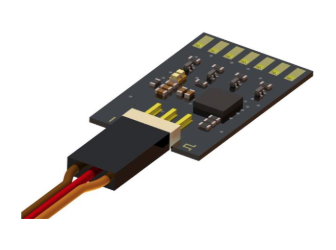

# castle-link-py
> Read/Write to Castle Creations ESC with Python



## Why?

Want to get the vEgo (velocity) of your rc-car without installing wheel encoders? How about realtime battery metrics? You can even control the throttle without a pwm driver! 

## How?

### Hardware
You are going to need some Castle Creations hardware.
- [Castle Creations ESC + Sensored Motor](https://www.castlecreations.com/products-search?qs=Sensored+motor)
- [Castle Serial Link](https://www.castlecreations.com/en/serial-link-010-0121-00)
- [FTDI USB to TTY Adapter](http://www.hiletgo.com/ProductDetail/2152064.html)

### Software

```
csl = CastleSerialLink(port="/dev/ttyUSB0", baudrate=115200)
```

### Read

```python
csl.listen(40) # background thread 40 Hz
for i in range(100):
    time.sleep(0.5)
    print(csl.state)
csl.stop()
```

### Write

```python
csl.write("throttle", 65535//2+3000)  # move forward
```

## Remove sudo requirement
```bash
sudo usermod -a -G dialout
```

## Refs
- [Castle Serial Link Docs](https://www.astramodel.cz/manualy/castle_creations/castle_serial_link_v1_5.pdf)
- [Castle Link Live Communication Protocol](https://www.castlecreations.com/castle-link-live)
